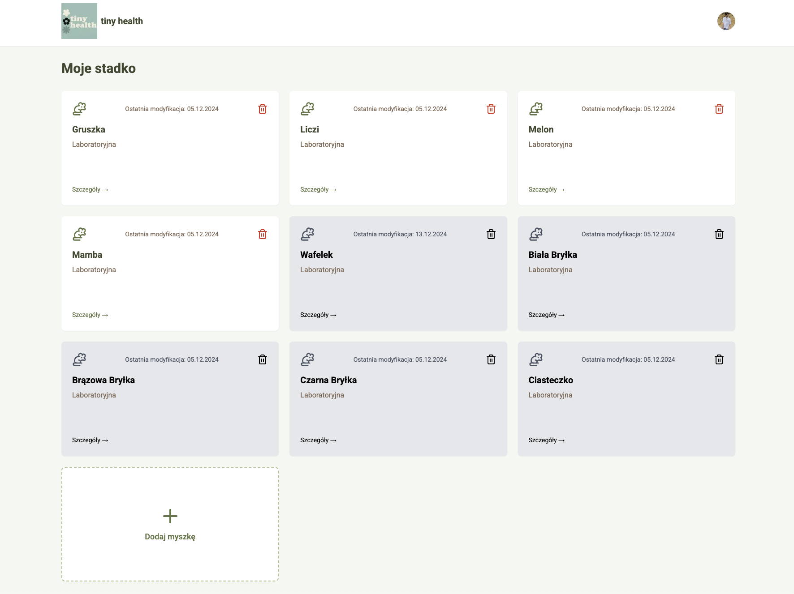
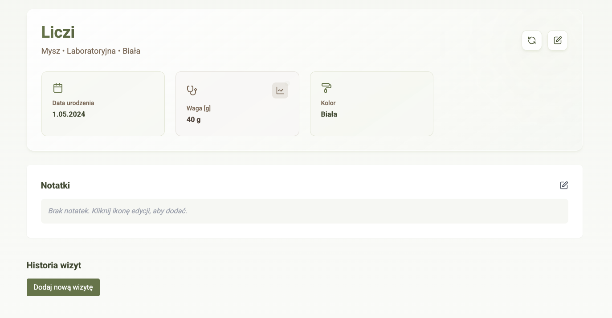

# 🐁 Tiny Health

<div align="center">
  
  
</div>

## About

Tiny Health is a personal project born from the need to better manage and track the health of pet mice. As a mice owner, I wanted a centralized solution to:

- Track individual mice health records
- Store veterinary visit history
- Manage medical records
- Organize mice photos

This project also served as a learning ground to deepen my understanding of modern web technologies, particularly Next.js, React, and React Query.

## 🚀 Tech Stack

- **Frontend Framework**: Next.js 14 with App Router
- **UI/Styling**: React, Tailwind CSS
- **State Management**: React Query
- **Database**: Supabase
- **Authentication**: Clerk with Google Sign-in
- **Hosting**: Vercel
- **ORM**: Prisma

## 🛠️ Getting Started

### Prerequisites

- Node.js (v18 or higher)
- npm or yarn
- Supabase account
- Clerk account

### Installation

1. Clone the repository

```bash
git clone https://github.com/yourusername/tiny-health.git
cd tiny-health
```

2. Install dependencies

```bash
npm install
# or
yarn install
```

3. Set up environment variables

```bash
cp .env.example .env.local
```

Fill in your Supabase and Clerk credentials in `.env.local`

4. Set up the database

```bash
npx prisma migrate dev --name init
```

5. Start the development server

```bash
npm run dev
# or
yarn dev
```

The application will be available at `http://localhost:3000`

## 💅 Development

### Code Formatting

```bash
npx prettier --write "**/*.ts"
```

<div align="center">
  Made with ❤️ for our tiny friends 🐁
</div>
