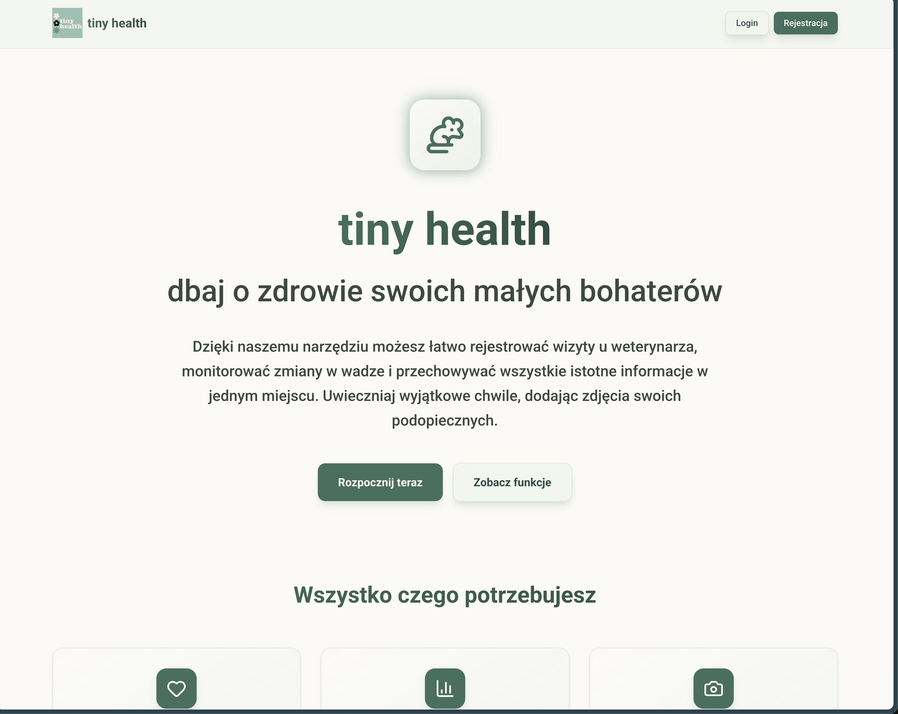
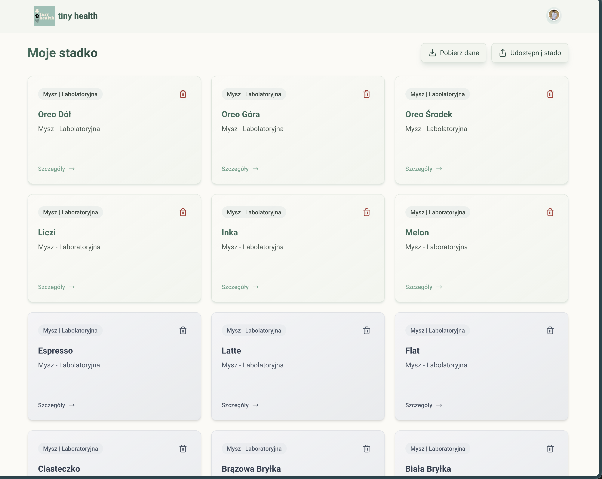

<div align="center">
  

  # Tiny Health

  **A cozy little home for your pet's health records — built with rodents in mind. 🐹**

  
  
</div>

---

## About

Tiny Health is a small, friendly web app for keeping track of your pets' health
in one place. It's built especially for **rodents** — hamsters, guinea pigs,
rats, and friends — but it works just as happily for any small companion.

Pet lives are short, and the little details are easy to forget: when the last
vet visit was, which medication was prescribed, how the weight has been trending.
Tiny Health gathers all of that into one calm, tidy place so you can focus on
caring for your pet instead of digging through notes.

The interface is in **Polish** and the design leans into soft cards, an
earthy green palette, and gentle glassmorphism surfaces — it's meant to feel
warm, not clinical.

## Features

- 🐾 **Pet profiles** — create and manage a profile for each of your pets.
- 🩺 **Vet visits & medications** — log dated visits and the treatments that came with them.
- ⚖️ **Weight tracking** — record weight over time and watch the trend on a chart.
- 📝 **Notes** — jot down anything worth remembering for each pet.
- 📷 **Photos** — upload and browse a gallery of pet pictures.
- 🤝 **Sharing** — share all your pets with another user by email (great for family or a partner).
- 📦 **Data export** — download a pet's profile, visits, and weight history as a ZIP of CSV files.
- 📥 **Bulk CSV import** — add many pets at once from a CSV file.
- 🪦 **Lifecycle aware** — gently keeps the pets you've lost in their own place, after the living ones.

## Tech Stack

| Area | Choice |
| --- | --- |
| Framework | Next.js 16 (App Router) + React 19 |
| Language | TypeScript |
| Styling | Tailwind CSS 4 toolchain |
| Database | PostgreSQL via Prisma 6 |
| Auth | Clerk (Polish localization) |
| Client data | TanStack React Query |
| Media storage | DigitalOcean Spaces (S3-compatible, AWS SDK v3) |
| Charts | Recharts |
| Animation | Framer Motion |
| Testing | Jest + Testing Library |

## Quickstart

### Run locally

```bash
npm install
cp .env.example .env

# Start local Postgres, apply migrations, and seed sample data
npm run db:docker:up

# Start the dev server
npm run dev
```

The Docker setup creates two local PostgreSQL databases on first startup:

- `tiny_health` for the app
- `tiny_health_shadow` for Prisma's shadow database

`npm run db:docker:up` waits for Postgres, runs `prisma migrate deploy`, regenerates the Prisma client, and inserts a small sample dataset for local testing.

If you want the seeded pets to appear for your own Clerk account, set `LOCAL_SEED_OWNER_ID` in `.env` to your Clerk user ID before running the seed.

If you want a clean reseed, run:

```bash
npm run db:docker:reset
```

Fill in the required environment variables in `.env` before starting —
see [Environment variables](#environment-variables) below.

The app runs at `http://localhost:3000`.

### Build

```bash
npm run build
npm run start
```

### Useful scripts

| Script | What it does |
| --- | --- |
| `npm run dev` | Start the dev server |
| `npm run build` | Production build |
| `npm run start` | Run the production build |
| `npm run lint` | Lint with ESLint |
| `npm run test` | Run the Jest test suite |
| `npm run generate` | Regenerate the Prisma client |
| `npm run db:docker:up` | Start local Postgres, migrate, and seed |
| `npm run db:docker:down` | Stop the local Postgres container |
| `npm run db:docker:reset` | Recreate and reseed the local databases |

> **Node version:** 22.x — `npm` is the package manager in use (`package-lock.json` is committed).

## Environment variables

Set these in `.env` (see `.env.example` as a starting point):

| Variable | Purpose |
| --- | --- |
| `DATABASE_URL`, `DIRECT_URL`, `SHADOW_DATABASE_URL` | PostgreSQL connections for Prisma |
| `NEXT_PUBLIC_CLERK_PUBLISHABLE_KEY`, `CLERK_SECRET_KEY` | Clerk authentication |
| `LOCAL_SEED_OWNER_ID`, `LOCAL_SEED_SHARED_WITH` | Optional owner/share IDs for local sample data |
| `SPACES_ENDPOINT`, `SPACES_REGION`, `SPACES_BUCKET` | DigitalOcean Spaces bucket |
| `SPACES_ACCESS_KEY_ID`, `SPACES_SECRET_ACCESS_KEY` | Spaces credentials |
| `SPACES_PUBLIC_BASE_URL` | Public base URL for media |
| `MAX_DB_POOLING_SIZE` | Database connection pool size |

## Architecture

- **Framework** — Next.js App Router (`src/app`) with a mix of server and client components.
- **API** — Route handlers under `src/app/api`, with versioned endpoints under `src/app/api/v1`.
- **UI** — Reusable React components in `src/components`; global Tailwind styles in `src/app/globals.css`.
- **Data access** — Prisma schema in `prisma/schema.prisma`, client helper in `src/utils/prisma.ts`.
- **Auth** — Clerk integration, with route protection in `src/proxy.ts` and provider wiring in `src/app/providers.tsx`.
- **Access control** — Shared sharing/ownership rules centralized in `src/utils/pet-access.ts` (owners and shared users can read/write; only owners can delete).
- **Client data fetching** — React Query hooks and cache invalidation in `src/hooks`.
- **Uploads & media** — Two-step signed upload flow against DigitalOcean Spaces: request a signed URL, then persist the file record. Helpers live in `src/utils/spaces.ts`.

`Pet.uuid` is the public identifier used in URLs (`/pet/[id]`); internal relations
still use numeric `id`.

## Bulk importing pets from CSV

You can add many pets at once from the dashboard using the **"Importuj z CSV"**
button (also shown on the empty dashboard for new accounts).

1. Click **"Pobierz przykładowy szablon CSV"** in the import dialog to download a
   template with the expected columns and an example row.
2. Fill in one row per pet. The first row must be the header row.
   - Required columns: `name` (pet's name) and `bornAt` (birth date, `YYYY-MM-DD`).
   - Optional columns: `animalType`, `breed`, `color`, `weight` (grams), `notes`,
     `isDead` (`true`/`false`), `deathDate` (`YYYY-MM-DD`, used when `isDead` is true).
   - Wrap any field containing a comma or quote in double quotes (standard CSV
     quoting), e.g. `"Brązowo-biały"`.
3. Upload the CSV in the import dialog and click **"Importuj"**.
4. Each row is validated and imported independently — valid rows are created as
   new pets owned by your account, and any invalid rows are listed with an error
   message so you can fix and re-upload just those.

## Deployment

The app is deployed on **DigitalOcean**, connected to the `main` branch with
autodeploy enabled — approved pull requests merged to `main` ship to production
automatically. Treat `main` as production-connected and work through pull
requests.

## Contributing

1. Branch from `main` (name the branch after the issue you're working on).
2. Keep changes minimal and follow the existing App Router conventions.
3. Run `npm run lint` and `npm run test` before opening a PR — and `npm run generate` if you touched the Prisma schema.
4. Open a pull request; changes reach production only after merging to `main`.
